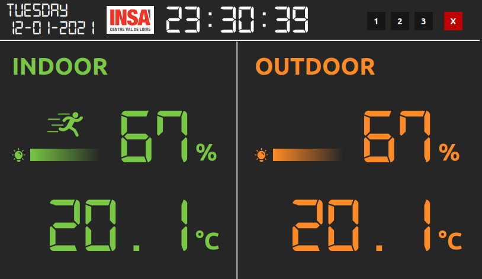

# Smart Home Projet Fin d'Etude Wiki <!-- omit in toc -->

  

- [1. Introduction](#1-introduction)
- [2. Project description](#2-project-description)
- [3. Divers](#3-divers)

## 1. Introduction

This project concern the development of an application on Raspberry Pi to display data from multi sensors.  

  

**Final product**

## 2. Project description

This project is used to measure indoor and outdoor environment like temperature, humidity, luminosity and mouvement. 

Each sensor contain temperature sensors, humidity sensors,... and ESP32 to gathering data and communicating with raspberry pi. The communication between ESP32 and sensors is I2C and SPI, between ESP32 and raspberry pi is MQTT.  

Raspberry Pi is the local server. Its job to gathering all data from every ESP32 and save, display them on a screen

## 3. Divers

All information is in Wiki directory

Welcome and feel free to share information

1. [Basic how-tos](Wiki/HOWTOS.md) "Miscellaneous useful how-tos"
2. [Naming rules](Wiki/Naming_rules.md) "Naming rules for source code"
3. [Coding rules](Wiki/Coding_rules.md) "Better, Cleaner, smarter, ..."
